### Kubecon Cloudnativecon EU 2018 Highlights

--- 
Sayan Hazra (sayan.hazra@sap.com)

Ajit Singh Chahal (ajit.singh.chahal@sap.com)
---
### Disclaimer
---
### Copenhagen


Note:
How was Copenhagen?
---
### Opensource / Community / Code
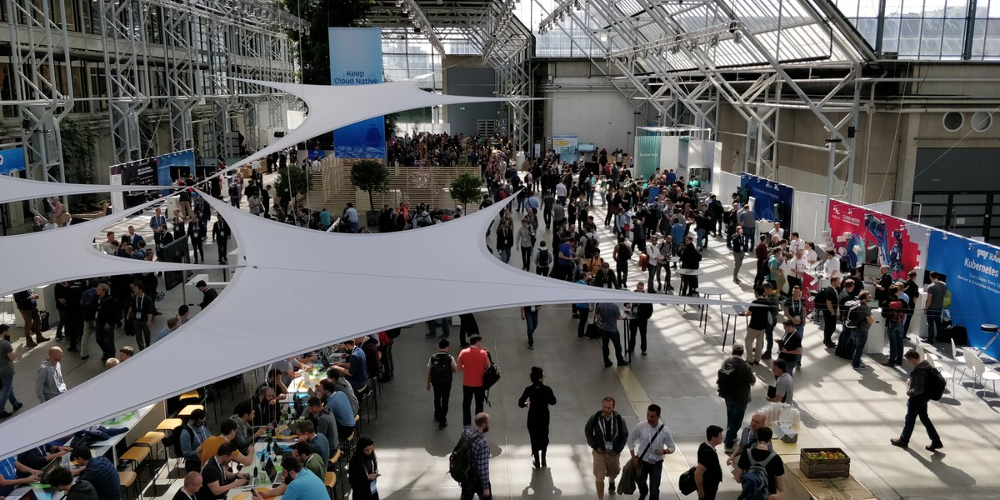
<!-- It was about the community..... met developers from kubeless with whom I work over github...few people SIG api machinery... -->
---
### AGENDA
- General news
- k8s runtimes
- Monitoring
- k8s Controller/CustomResourceDefinitions

Note:
Sayan
---
### General News

Note:
    Ajit: How can I contribute a project to CNCF?
---
### CNCF project workflow
- Sandbox   <!-- .element: class="fragment" -->
- Incubation <!-- .element: class="fragment" -->
- Graduated <!-- .element: class="fragment" --> 

---
### Sandbox

- Rook <!-- .element: class="fragment" --> [deep dive](https://www.youtube.com/watch?v=yknGKzJw7_k&list=PLj6h78yzYM2N8GdbjmhVU65KYm_68qBmo&index=272&t=0s)  <!-- .element: class="fragment" -->
<!-- Rook turns distributed storage software into a self-managing, self-scaling, and self-healing storage services. It does this by automating deployment, bootstrapping, configuration, provisioning, scaling, upgrading, migration, disaster recovery, monitoring, and resource management. Rook comes with a rook operator and it is a 1st class citizen on k8s which does its job from the cluster itself. -->

- Open Policy Engine <!-- .element: class="fragment" --> [intro](https://www.youtube.com/watch?v=XEHeexPpgrA&t=0s&list=PLj6h78yzYM2N8GdbjmhVU65KYm_68qBmo&index=195) <!-- .element: class="fragment" -->
<!-- The Open Policy Agent (OPA) is an open source, general-purpose policy engine that enables unified, context-aware policy enforcement across the entire stack. -->

- Spiffe and Spire <!-- .element: class="fragment" --> [deep dive](https://www.youtube.com/watch?v=sXwFB34BBrM&t=0s&list=PLj6h78yzYM2N8GdbjmhVU65KYm_68qBmo&index=167) <!-- .element: class="fragment" -->

<!--  The Secure Production Identity Framework For Everyone (SPIFFE) Project defines a framework and set of standards for identifying and securing communications between web-based services. At its heart, SPIFFE is:

A standard defining how services identify themselves to each other. These are called SPIFFE IDs and are implemented as Uniform Resource Identifiers (URIs).

A standard for encoding SPIFFE IDs in a cryptographically-verifiable document called a SPIFFE Verifiable Identity Document or SVIDs. -->

Note:
    Ajit: What was new on storage solution in k8s?
    Sayan: Rook

---
### Incubation
- CoreDNS <!-- .element: class="fragment" -->
- Prometheus <!-- .element: class="fragment" -->
- Envoy  <!-- .element: class="fragment" -->
<!-- Envoy is a high performance C++ distributed proxy designed for single services and applications, as well as a communication bus and “universal data plane” designed for large microservice “service mesh” architectures. Used in: istio, heptio+contour -->
- Linkerd  <!-- .element: class="fragment" -->
<!-- Linkerd is a transparent service mesh, designed to make modern applications safe and sane by transparently adding service discovery, load balancing, failure handling, instrumentation, and routing to all inter-service communication. -->
- Jaegar  <!-- .element: class="fragment" -->
<!-- Distributed tracing solution -->
- Fluentd   <!-- .element: class="fragment" -->
- Open Tracing   <!-- .element: class="fragment" -->
- NATS   <!-- .element: class="fragment" -->
- CNI   <!-- .element: class="fragment" -->
- gRPC   <!-- .element: class="fragment" -->
- Vitess   <!-- .element: class="fragment" -->
<!-- Vitess is a database clustering system for horizontal scaling of MySQL through generalized sharding. By encapsulating shard-routing logic, Vitess allows application code and database queries to remain agnostic to the distribution of data onto multiple shards. With Vitess, you can even split and merge shards as your needs grow, with an atomic cutover step that takes only a few seconds. -->
- TUF   <!-- .element: class="fragment" -->
<!-- 
The Update Framework (TUF) helps developers maintain the security of a software update system, even against attackers that compromise the repository or signing keys. TUF provides a flexible framework and specification that developers can adopt into any software update system. -->

Note:
    Ajit: Prometheus covering later. What's so cool about Envoy?     Ajit: Is there a way to take care DBs in k8s?    Ajit: Is there any project which actually graduated?
---
### Graduated
##### No surprises <!-- .element: class="fragment" -->
#### Kubernetes <!-- .element: class="fragment" -->
---
### Istio 0.8
- (Hybrid) multicluster support [talk](https://www.youtube.com/watch?v=bLJL53UIcqI&t=0s&list=PLj6h78yzYM2N8GdbjmhVU65KYm_68qBmo&index=54)

Note:
    Ajit: istio is all about separating networking details from application? How istio 0.8 connects inter cloud k8s clusters? Ajit: How have statefulsets evolved so far? Are there any example?

<!-- There are various use cases with hybrid clouds. By hybrid, it can mean apps running in public cloud, on prem bare metal. Now the problem they are trying to solve is not to have multiple tools to manage these. There should be one standardized tool to manage these. Enter istio, which can provide fine grained canary deployment, intelligent routing of svc requests, secure service communication. Now with the multi cluster feature, istio is able to do these across multiple clusters.... the demo was quite interesting where there are 2 clusters ...the primary cluster has a istio pilot or the control plane running and the secondary one had a headless svc of the pilot running... the primary pilot can then discover all the envoys running across clusters...standard policies can defined which is valid for both the clusters...for example: intelligent routing of svc requests can be done across multiple clusters....  some prerequisites:
Two or more Kubernetes clusters with 1.7.3 or newer.

The ability to deploy the Istio control plane on one Kubernetes cluster.

The usage of an RFC1918 network, VPN, or alternative more advanced network techniques to meet the following requirements:

Individual cluster Pod CIDR ranges and service CIDR ranges must be unique across the multicluster environment and may not overlap.

All pod CIDRs in every cluster must be routable to each other.

All Kubernetes control plane API servers must be routable to each other.

Currently only manual sidecar injection has been validated with multicluster.
-->

---
### Spark operator
- [talk](https://www.youtube.com/watch?v=2eAOx8E6-5Q&index=16&list=PLj6h78yzYM2N8GdbjmhVU65KYm_68qBmo&t=818s) / [github](https://github.com/GoogleCloudPlatform/spark-on-k8s-operator)
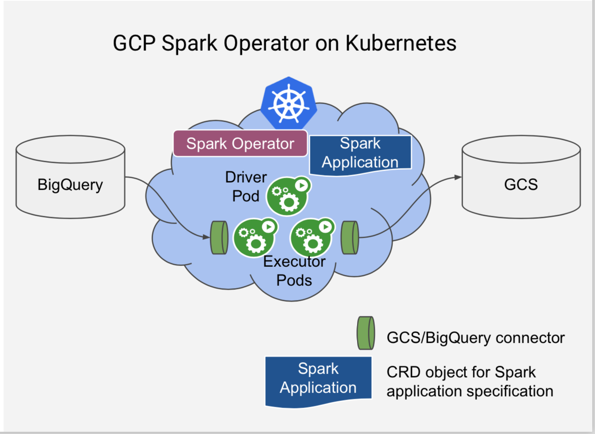 

<!-- Handling stateful application in k8s got better with time....Container Storage Interface reached beta 1.10 ... which brings us to spark operator on k8s... demo included: deploying of spark operator and then running spark jobs as an yaml.... a job is corresponding to CRD kind SparkApplication....although Customization of Spark pods, e.g., mounting ConfigMaps and PersistentVolumes is currently experimental and implemented using a Kubernetes Initializer, which is a Kubernetes alpha feature and requires a Kubernetes cluster with alpha features enabled. The Initializer can be disabled if there's no need for pod customization or if running on an alpha cluster is not desirable. -->
Note:
    Ajit: So Sayan, in Kyma you are using KUbeless, right? In an event driven world, how are you listening to events from multiple cloud providers? 
    Sayan: Not yet.....

---
### Cloudevents.io [talk](https://www.youtube.com/watch?v=TZPPjAv12KU&list=PLj6h78yzYM2N8GdbjmhVU65KYm_68qBmo&index=288&t=7s) <!-- .element: class="fragment" -->
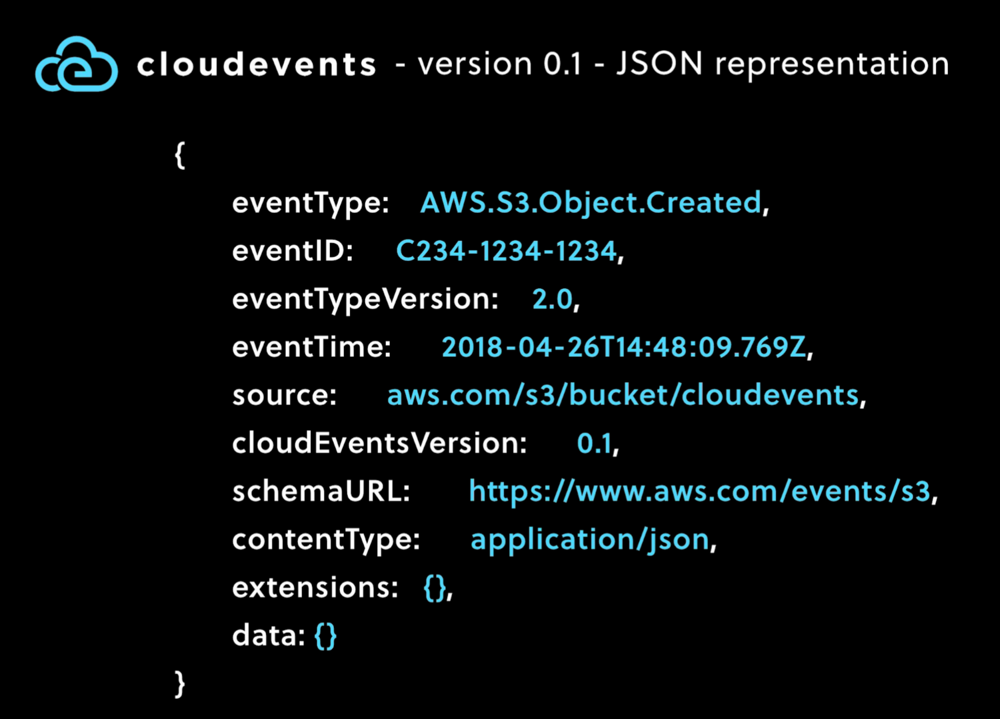 
<!--  In a serverless world, functions are the unit of deployment...There are strong trends in this computing model e.g. aws lambda..azure functions ... open source e.g. kubeless , open whisk... and the bottomline is the same..they have a similar trait....pay for use... don't have to manager servers.....and event driven programming model....functions are incomplete without events.... especially IOT or integrations in CI/CD .... so there is a dire need to harmonize the event/Apis/etc... And cloudevents is all about harmonizing events .... cloudevents 0.1 came to picture which has a standard envelope which will help publishers/subscribers/middlerware to better process/route/version/event data .... Here's a JSON representation of cloud events .... eventTypeVersion... data for the actual data....he even had an amazing demo with multiple providers like AWS, google, SAP predicting an image.... and SAP leonardo was doing top notch predictions in comparison to google and amazon ML solutions.   -->

Note:
    Ajit: I'm using dockerd as a container runtime. Is it the only option?    

---
## Container runtimes
<!-- Container runtimes are softwares which can create and execute containers that are typically fetched from online images. A container is created from a container image. Images are tarballs with a JSON configuration file attached. Images can be nested where image A is built on top of image B which in turn built from image C. If necessary runtime downloads image from some registry that exposes metadata and files for download over HTTP. The runtime extracts that layered image onto a copy-on-write (CoW) filesystem. This is usually done using an overlay filesystem, where all the container layers overlay each other to create a merged filesystem. This step is not generally directly accessible from the command line but happens behind the scenes when the runtime creates a container. Finally, the runtime actually executes the container, which means telling the kernel to assign resource limits, create isolation layers (for processes, networking, and filesystems), and so on, using a cocktail of mechanisms like control groups (cgroups), namespaces, capabilities, seccomp, AppArmor, SELinux, and whatnot. For Docker, docker run is what creates and runs the container.  Docker's Standard Container manifesto came up which had OCI, CRI, CNI-->
- [What's up with different container runtimes](https://www.youtube.com/watch?v=lHv0LVEIPk8&t=23s&list=PLj6h78yzYM2N8GdbjmhVU65KYm_68qBmo&index=81)
- [Second Boom of Container Runtimes](https://www.youtube.com/watch?v=gVqa1cNIZT0&t=0s&index=332&list=PLj6h78yzYM2N8GdbjmhVU65KYm_68qBmo)
- Article: [Demystifying container runtimes](https://lwn.net/Articles/741897/)
---
## Landscape
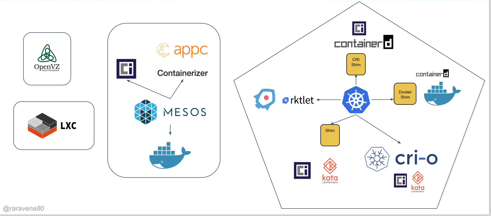
<!-- The landscape looks pretty much like this... openvz and lxc exist by itself. Mesos came up as a paper in UC Berkeley. And there is this hotpotch of all runtimes -->
---
### Container Runtime Interface(CRI)
- Why CRI?
<!-- Supporting interchangeable container runtimes is not a new concept in Kubernetes. In the 1.3 release, we announced the rktnetes project to enable rkt container engine as an alternative to the Docker container runtime. However, both Docker and rkt were integrated directly and deeply into the kubelet source code through an internal and volatile interface. Such an integration process requires a deep understanding of Kubelet internals and incurs significant maintenance overhead to the Kubernetes community. These factors form high barriers to entry for nascent container runtimes. By providing a clearly-defined abstraction layer, we eliminate the barriers and allow developers to focus on building their container runtimes. This is a small, yet important step towards truly enabling pluggable container runtimes and building a healthier ecosystem.

 -->

- gRPC services
    - ImageService
    - RuntimeService

<!-- Each container runtime has it own strengths, and many users have asked for Kubernetes to support more runtimes. In the Kubernetes 1.5 release, the Container Runtime Interface (CRI) was introduced. It is a plugin interface which enables kubelet to use a wide variety of container runtimes, without the need to recompile. CRI consists of a protocol buffers and gRPC API, and libraries, with additional specifications and tools under active development.

It is just an interface which got introduced in 2016. This makes k8s talk to different runtimes. There are plugins available for CRIO, Frakti, rklet, containerd-CRI plugin(CRI-containerd) -->

<!-- Kubelet communicates with the container runtime (or a CRI shim for the runtime) over Unix sockets using the gRPC framework, where kubelet acts as a client and the CRI shim as the server.

The protocol buffers API includes two gRPC services, ImageService, and RuntimeService. The ImageService provides RPCs to pull an image from a repository, inspect, and remove an image. The RuntimeService contains RPCs to manage the lifecycle of the pods and containers, as well as calls to interact with containers (exec/attach/port-forward). A monolithic container runtime that manages both images and containers (e.g., Docker and rkt) can provide both services simultaneously with a single socket. The sockets can be set in Kubelet by –container-runtime-endpoint and –image-service-endpoint flags. 

Speaker explains in detail how can one implement a new OCI compliant runtime

-->
<!-- Talk by Harry Zhang & Xu Wang, HyperHQ  -->

---
## Containerd
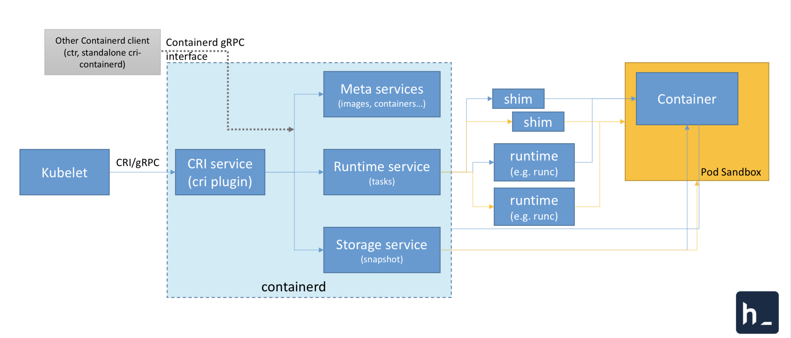
###### [Intro](https://www.youtube.com/watch?v=I0xU6nxnZLY&t=0s&index=335&list=PLj6h78yzYM2N8GdbjmhVU65KYm_68qBmo) and [Deep dive](https://www.youtube.com/watch?v=3AynH3c0F8M&list=PLj6h78yzYM2N8GdbjmhVU65KYm_68qBmo&index=257&t=0s) talks

<!-- Why another containerd? containerd is an industry-standard core container runtime with an emphasis on simplicity, robustness and portability. It is available as a daemon for Linux and Windows, which can manage the complete container lifecycle of its host system: image transfer and storage, container execution and supervision, low-level storage and network attachments, etc.. Docker engine was getting bigger -->

<!-- Gives an ala carte experience: pluggable .... speaker visits containerd architechture along with go code... stresses on flexible APIs which is based on gRPC api/metrics api

containerd includes a daemon exposing gRPC API over a local UNIX socket. The API is a low-level one designed for higher layers to wrap and extend. It also includes a barebone CLI (ctr) designed specifically for development and debugging purpose. It uses runC to run containers according to the OCI specification. 

Talks how image pulling works and how container is started? There is CRI support now 

kubelet talks to containerd daemon with the help of CRI which takes care of runtime, image service and initialization of pods

The containerd CRI support is GA now

Now the question is can we run get rid of docker in any form or the other?

-->
---
### CRIO
- Pronounced as ***cry+o***

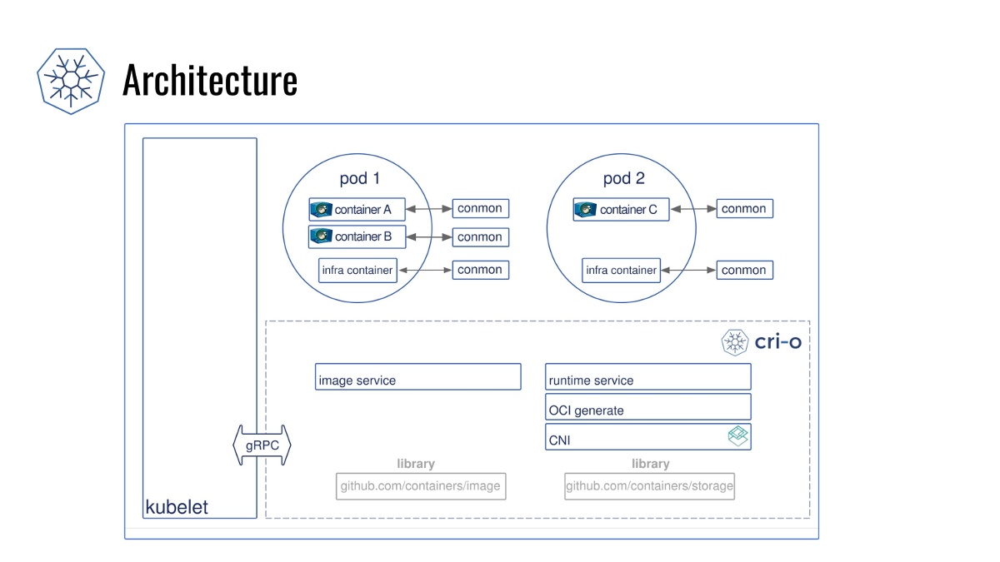
<!-- CRI-O has an interesting architecture. It reuses basic components like runc to start containers, and software libraries like containers/image and containers/storage, created for the skopeo project, to pull container images and create container filesystems. A separate library called oci-runtime-tool prepares the container configuration. CRI-O introduces a new daemon to handle containers called conmon. The conmon daemon is needed here to do all of the things that systemd doesn't (want to) do. But even though CRI-O doesn't use systemd directly to manage containers, it assigns containers to systemd-compatible cgroups, so that regular systemd tools like systemctl have visibility into the container resources. Since conmon (and not the CRI daemon) is the parent process of the container, it also allows parts of CRI-O to be restarted without stopping containers, which promises smoother upgrades. This is a problem for Docker deployments right now, where a Docker upgrade requires restarting all of the containers. This is usually not much trouble for Kubernetes clusters, however, because it is easy to roll out upgrades progressively by moving containers around.-->

---
### Frakti
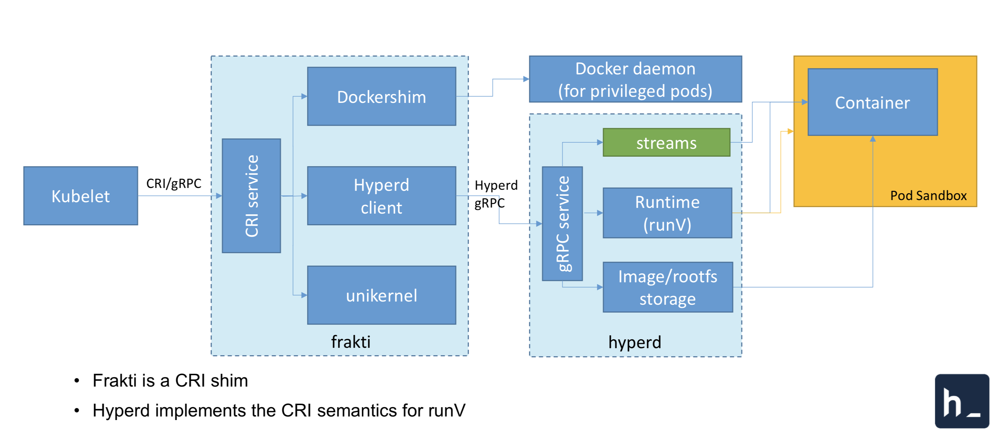
- Developed by hyper.sh

<!-- Another CRI implementation which is used to spawn containers based on VMs...this was the 1st non-docker based CRI implementation..Here we see kubelet talking to hyperd client to start runv based containers... for priviledged, it talks to docker shim....it even has unikernel support 

The speaker goes in detail as in how hyperd talks to the gRPC service 

Now runv based containers bring us to kata containers, -->

---
### Kata containers

- Clear containers + runV
- Talk [Overview of Kata containers](https://www.youtube.com/watch?v=bUOIJBUPPck&t=0s&index=341&list=PLj6h78yzYM2N8GdbjmhVU65KYm_68qBmo)
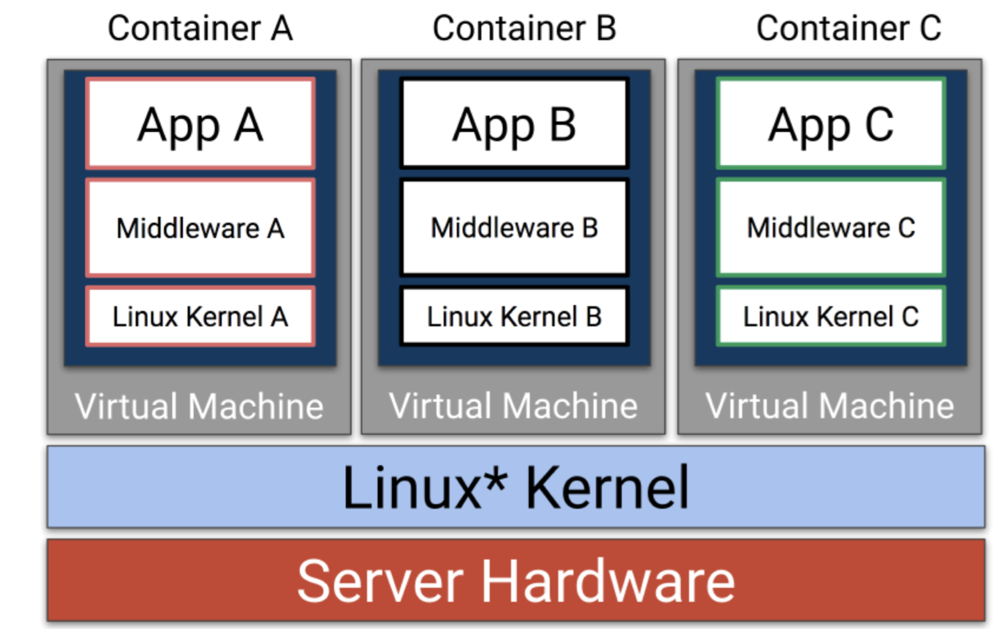

<!-- Introduced in 2017, by OpenStack and mostly community driven. Combination of runv(hyper.sh) and clear containers(Intel)... it is OCI compliant...all they are trying is to run containers based on VMs 

Each container is booted as a lightweight virtual machine with its own unique kernel instance. Since each container is now running with its own VM, they no longer gain access to the host kernel and get the full security benefits of a virtual machine.
The Clear Linux kernel and Clear Containers userspace are features of that mini-OS for container boot performance. Since Clear Containers is OCI compatible, changing your local Docker* to use cc-runtime in addition to runc is really simple.
vision:
 - light and fast vm based containers
 - merge runv and clear container
 - seamless integration with k8s with OCI specs and runC compatible command line
 - support multiple hypervisor
 - support multiple architectures

Each pod is isolated by the hypervisor
2 levels of isolation
The speaker goes on talking about how integration with CRI is done...he explains how CRIO or containerd integrates with kata as well as how frakti integrates with Kata containers
-->
Note: 
    Ajit: Prepare
---
### Other noteable runtimes
- Mesos
- nvidia runtime(GPU)
- railcar(rust)
- pouch(alibaba)
- systemd-nspawn
- lmctfy

Note:
    Ajit: Sudden stop!!! Can we think something different?
---
### gVisor

- Talk [introduction to gVisor](https://www.youtube.com/watch?v=pWyJahTWa4I&t=0s&index=326&list=PLj6h78yzYM2N8GdbjmhVU65KYm_68qBmo)
- [Github](https://github.com/google/gvisor)

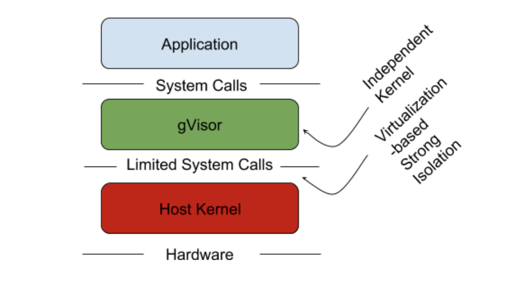

<!-- Although containers have come a long way in terms security, some of the enterprises still don't feel it safe enough. We have various ways of isolation using cgroups, namespaces, white listing syscalls with seccomp but again we see exploits happening. Google thinks sharing the same kernel or sharing same device drivers is the culprit. How can we deny Linux kernel being a huge attack surface. Hence VM based containers are way to go. But nothing comes free, it has a significant resource footprint, inflexible in terms of resource usages and more code to run. Google claims to attack this problem in a different way using gVisor, where they are motivated by the VM based containers and decided not to share the kernel. 

The core of gVisor is a kernel that runs as a normal, unprivileged process that supports most Linux system calls(211). This kernel is written in Go, which was chosen for its memory- and type-safety. Just like within a VM, an application running in a gVisor sandbox gets its own kernel and set of virtualized devices, distinct from the host and other sandboxes.

gVisor provides a strong isolation boundary by intercepting application system calls and acting as the guest kernel, all while running in user-space. Unlike a VM which requires a fixed set of resources on creation, gVisor can accommodate changing resources over time, as most normal Linux processes do. gVisor can be thought of as an extremely paravirtualized operating system with a flexible resource footprint and lower fixed cost than a full VM.

they claim this is really good for small containers and bad for syscall heavy workloads...it got open sourced at the conference  

The gVisor runtime integrates seamlessly with Docker and Kubernetes though runsc (short for "run Sandboxed Container"), which conforms to the OCI runtime API.

 -->
Note:
Sayan: Monitoring and alerting is really critical. So what's going on in that space?
---
### Prometheus
- Toolkit for monitoring and alerting
- Pull based metrics gathering
- Simple text for metrics representation
- PromQL: powerful query language

Note:
Sayan: nice features, Prometheus was suffering from performance problems... Did the community take care of this in version2.0?
---
### Prometheus2 Features
- New time series database (can persist 1,000,000+ samples/core/sec to disk)
- Optimized scraping
- Prometheus rules in standard yaml, instead of proprietary DSL
+++
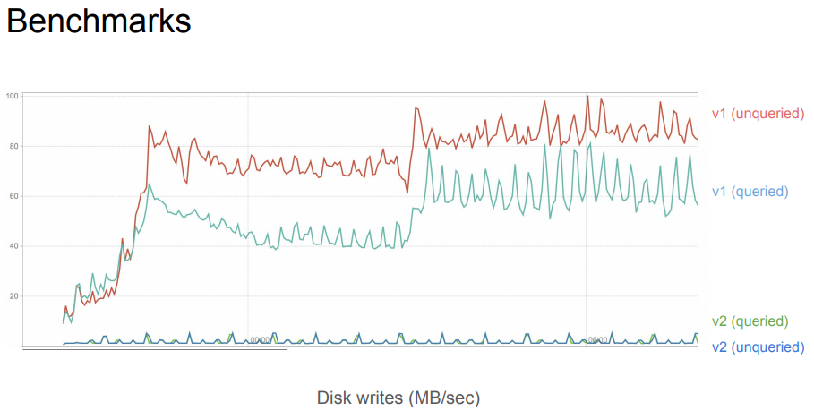
+++
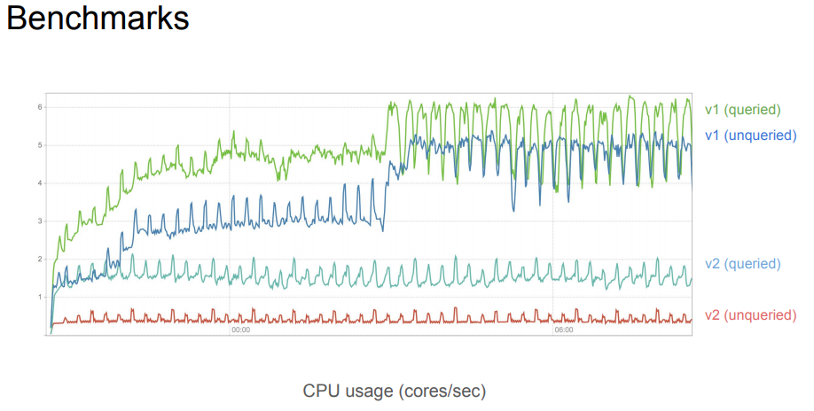
+++
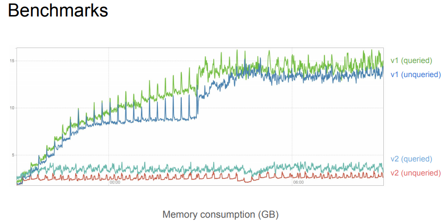
+++
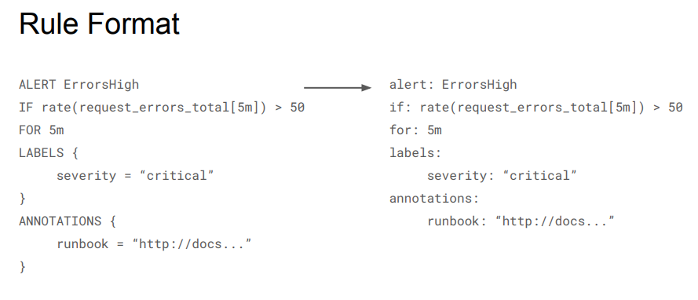
Note:
Sayan: That fine but what about autoscaling.
---
### Horizontal Pod Autoscaler
- V1: cpu based auto scaling only
- V2: autoscaling with custom metrics (beta)
- Custom metrics adapter is required (https://github.com/DirectXMan12/k8s-prometheus-adapter)
+++
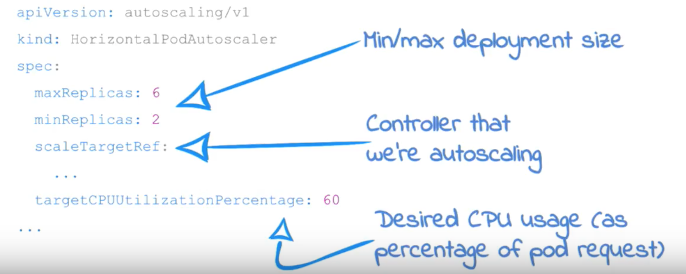
+++
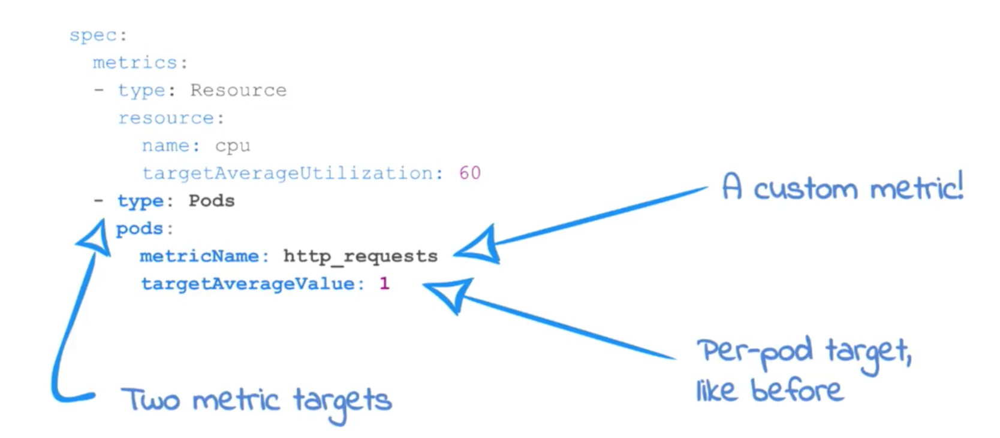

CNCF Talk https://youtu.be/1xm_ccAYO90

Note:
    Ajit: We are pretty new to k8s custom controllers.... can you throw some light on that?
---
### k8s Controllers
- Talks: [intro](https://www.youtube.com/watch?v=AUNPLQVxvmw&list=PLj6h78yzYM2N8GdbjmhVU65KYm_68qBmo&index=213&t=1246s), [another example](https://www.youtube.com/watch?v=7wdUa4Ulwxg&list=PLj6h78yzYM2N8GdbjmhVU65KYm_68qBmo&index=211&t=1s)
- Control loop

```golang
for {
 current := getCurrentState()
 desired := getDesiredState()
 makeChanges(current, desired)
 }
 ```
equivalent to
```golang
func (c* Ctrl) worker {
    for c.processItem() {
    }
}
```

```golang
func (c *Ctrl) processNextItem {
    item := c.queue.Get()
    err := c.syncHandler(item)
    c.HandleErr(err, item)
}
```
<!-- Heart of the controller: 
A controller essentially gets a current state, a desired state and make changes to go to the desired state
doc: https://medium.com/@cloudark/kubernetes-custom-controllers-b6c7d0668fdf  -->


---
### Shared Informers - Event Handler

```golang
podInformer.Informer().AddEventHandler(
    cache.ResourceEventHandlerFuncs{
    // react to newly added object
    AddFunc: func(obj interface{}) {},
    // react to update to the object 
    UpdateFunc: func(old, cur interface{}) {}, 
    // react to object removal
    DeleteFunc: func(obj interface{}) {},
}) 
```

<!-- SharedInformer has a shared data cache and is capable of distributing notifications for changes to the cache to multiple listeners who registered via AddEventHandler. 

 These are the callback functions which will be called by the Informer when it wants to deliver an object to your controller. The typical pattern to write these functions is to obtain the dispatched object’s key and enqueue that key in a work queue for further processing.
 
 The speaker stresses on using this cache which is quite different from cronjob controller which he wrote .... and claims cron job controller is unsafe for a really large number of jobs. -->
---
### Shared Informers - Lister

```golang
    podStore = podInformer.Lister()
```
<!-- There is huge difference in accessing Lister in Shared Informers and lister in client-go. Accessing client-go lister means hitting the api server but in SharedInformer Lister is accessing the cache which is much safer. -->
---
### Sync handler
```golang
func (c *Ctrl) syncHandler(key string) error {
    // Convert into a distinct namespace and 
    name ns, name, err := cache.SplitMetaNamespaceKey(key) // Get the object
    podTmp, err := c.podsLister.Pods(ns).Get(name) // !!! IMPORTANT !!!
    pod := podTmp.DeepCopy()
    // ... your logic goes here ...
    return nil
}
```
<!-- And the meat of the controller goes here...which gets triggered on each change of the resource....Basically 1st thing to work is to get the namespace and the specific name of the resource. You will get the objects from the cache

Cause you are using a shared cache, you are getting a pointer to the object… if you are changing the object, you have to do a deepCopy() of the object. Again, deepCopy() is really expensive, don’t do it too soon.
-->

Note:
    Ajit: These are fine. But can you make my life easier? 
---
### Kube builder

- https://github.com/kubernetes-sigs/kubebuilder
- ```bash
pkg/apis/<group>/<version>/<kind>_types.go```

<!-- It is based on downloading a tar file and it will fill in the core controller logic for you…Resources are defined under pkg/apis/<group>/<version>/<kind>_types.go. Resources may be annotated with comments to identify resources to code generators. Comments are also used to generate field validation. Notably client generation, CRD generation, docs generation and config generation are all driven off of annotations on resources package.
-->
---
### Operator framework 
#### https://coreos.com/blog/introducing-operator-framework
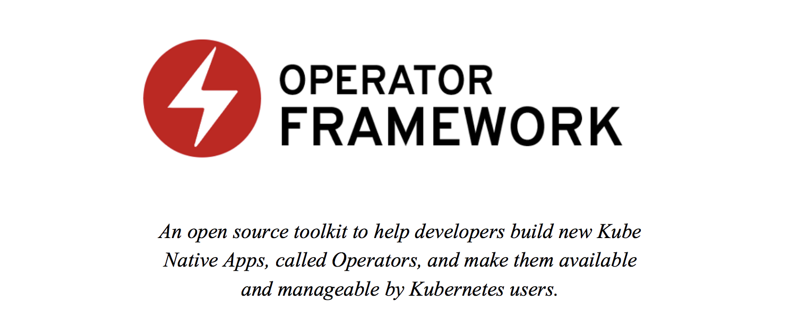 

<!-- Operator framework is an open source toolkit designed to manage Kubernetes native applications, called Operators, in a more effective, automated, and scalable way. 

An Operator is a method of packaging, deploying and managing a Kubernetes application. A Kubernetes application is an application that is both deployed on Kubernetes and managed using the Kubernetes APIs and kubectl tooling. To be able to make the most of Kubernetes, you need a set of cohesive APIs to extend in order to service and manage your applications that run on Kubernetes. You can think of Operators as the runtime that manages this type of application on Kubernetes.

-->

```bash
operator-sdk new app-operator --api-version=app.example.com/v1alpha1 --kind=App
```

<!-- So it comes with operator-sdk which will generate the scaffold as a new operator app for you.... this will take care of: tracking kube related resources, test scaffolding and repo organization....vendoring a working set of libraries ... Brandon also talks about how to manage the lifecycle of an operator through this framework.
Maintain a catalog of Operators and dependencies
Make an Operator available to specific namespaces
Track Operator app instances across namespaces
Apply updates to Operator app instances
-->
---
### More best practices
##### https://github.com/kubernetes/community/blob/master/contributors/devel/controllers.md
<!-- 
- Operate on one item at a time. Use workqueue.Interface to queue changes for a particular resource and later pop them in multiple gofuncs with a guarantee that no two gofuncs will work on the same item at the same time
- Random ordering between resources. When controllers queue off multiple types of resources, there is no guarantee of ordering amongst those resources.

-->
Note:
    Ajit: What's going on in the SIG: api-machinery?
---
### News on apiextensions-servers/CRD

- [Deep dive](https://www.youtube.com/watch?v=XsFH7OEIIvI&list=PLj6h78yzYM2N8GdbjmhVU65KYm_68qBmo&t=1833s&index=274) on API Machinery
- Support multiple versions (1.11+)
- Defaulting based on OpenAPI validation (1.11+)
- Serverside printing columns ("kubectl get" customization)(1.11+)
- Multiple versions with declarative field renames(1.12+)
- ... more

<!-- This talk was by one of the core maintainer of api-machinery Stefan Schimanski...shared the current status of the work going in this SIG 
As in here,

-->
---
### Internals of apiextensions-apiserver

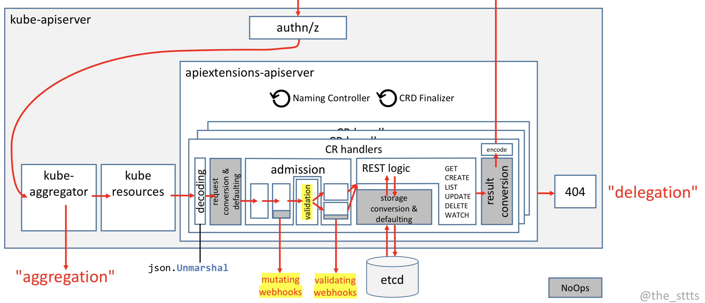

<!-- I felt the internals how a CRD is processed in k8s to be really intriguing

So this is how a kube api server looks like:

How a CRD is stored in ETCD ? It’s a JSON blob which is stored in etcd.

Admission webhooks: e.g. validating webhook which can validate whatever you like …. Or have mutating webhook: which can be used to mutate whatever you like… this is before REST logic..

Stresses on validation… right now, validation is not Turing complete and there are limitations.. As it is verbose, there are tools to generate openapi validations

there are other knitty gritty details about CRDs

spec/status split(although alpha): making status as a subresource
one security reason:
controller should change status
user should change spec

-->

---
## Thanks!
### Questions?
---
Back up 
---
### PodSecurityPolicy
<!-- An example and explain  -->


---
Draft
alert manager
metrics collection system
keynote prom 2.0 to get long term storage and other slides
custom metrics and auto scaling
TSDB DB
